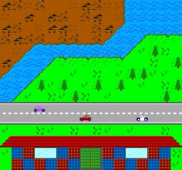

<!-- =============================================================== -->
The ljd 16-bit computer specification
=====================================

A complete cartridge-based 16-bit computer
with the following:
- 32 KB RAM
- Color display (240 x 200 pixels)
- Gamepad input

Cartridge:
- 96 KB ROM

Screenshot:

Component Specifications
------------------------

- CPU:  [cpu.md](cpu.md)
- Video:  [video.md](video.md)
- Gamepad:  [gamepad.md](gamepad.md)

System-level Specifications
---------------------------

- I/O Map:  [IO-map.txt](IO-map.txt)
- Notes on possible physical implementation:
  [notes/physical-implementation-ideas.md](notes/physical-implementation-ideas.md)

Implementations
---------------

- Complete computer emulator: <https://github.com/lj-ditrapani/16-bit-computer-scala>

Other projects implementing only individual components:
- CPU: <https://github.com/lj-ditrapani/16-bit-computer-cpu-coffeescript>
- Video (old, first design, incompatible with spec): <https://github.com/lj-ditrapani/original-design-16-bit-computer-video>
- CPU (old, first design, incompatible with spec): <https://github.com/lj-ditrapani/original-design-16-bit-computer-cpu>

Software
--------

- Rewriting assembler in scala
    - ASCII tiles to bin tiles transformer is working
    - Can assemble instructions in program-rom section
      (symbols, labels, data & video rom not implemented yet)
- Assembler (old version in ruby) <https://github.com/lj-ditrapani/original-design-16-bit-computer-assembler>
