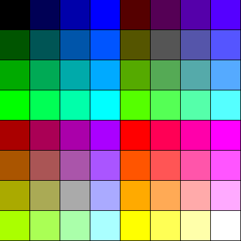

<!-- Author:  Lyall Jonathan Di Trapani =========|=========|======== -->
Video subsystem for LJD 16-bit computer
=======================================

Author:  Lyall Jonathan Di Trapani


Overview
--------

- 256 x 240 pixel screen
- Large tile set: 256 tiles (16 x 16, 2 bpp)
- Small tile set: 256 tiles (8 x 8, 1 bpp)
- 3 layers:
    - Background layer: 16 x 15 large cells per frame
    - Forground layer: 16 x 15 large cells per frame
    - Text layer: 32 x 30 small cells per frame
- Colors are 6-bits with (2:2:2) RGB color format
- Up to 64 simultaneous colors on screen


Video ROM
---------

```
Words   Purpose         Description
----------------------------------------------------------------
   32   Colors          64 8-bit colors; 16 groups of 4 colors
8,192   Large Tiles     256 16 x 16 2 bpp tiles (32 W / tile)
1,024   Small Tiles     256 8 x 8 1 bpp tiles (4 W / tile)

Total: 9,248 words
```


Video Ram
---------

```
Words   Purpose             Description
--------------------------------------------------------------------------
   64   Color set indexes   256 large tile color indexes; 4 bits per index
  480   Text Cells          32 x 30 text cells x 0.5 word
  120   Foreground Cells    16 x 15 cells x 0.5 word
  120   Background Cells    16 x 15 cells x 0.5 word

Total: 784 words
```

Video ram memory addresses.

```
Purpose                 Decimal          Hex
---------------------------------------------------------------------
Color sets              63,552-63,615   $F840-$F87F
Background Cells        63,744-63,863   $F900-$F7F7
Foreground Cells        63,872-63,991   $F980-$F9F7
Text Cells              64,000-64,479   $FA00-$FBDF
```


Color Set Entry
---------------

A color set entry consists of a set of 4 6-bit colors.
Each entry corresponds to a large tile.
Entry 0 is the color set for tile 0.
Entry 1 is the color set for tile 1, and so forth.
The color entry set defines the 4 color palette that the tile will
be painted with where ever it is placed on the cell grid.
The colors are labeled in order, from left to right, 0-3.

The 4 colors take up 2 16-bit words in memory:

```
 F E D C B A 9 8 7 6 5 4 3 2 1 0
---------------------------------
|    color 0    |   color 1     |
---------------------------------

 F E D C B A 9 8 7 6 5 4 3 2 1 0
---------------------------------
|    color 2    |   color 3     |
---------------------------------
```


Large Tile
--------------

```
Size:  32 words
16 x 16 pixel tiles = 256 pixels
2 bits per pixel (2 bpp)
Each word contains 8 pixels (1/2 row)
The pixel value serves as a lookup key into the tile's corresponding color set entry.
For a large tile used in the background layer, colors are as follows:
If the pixel is 0, it takes color 0.
If the pixel is 1, it takes color 1.
If the pixel is 2, it takes color 2.
If the pixel is 3, it takes color 3.
For a large tile used in the foreground layer, colors are looked up in
the same fashion, except if the pixel is set to 0, the pixel is
transparent.  In other words, the color selected for the background
tile pixel at that location is used instead of color 0.
So tiles placed in the foreground layer only use 3 colors (1-3) from
their palette, because color 0 is transparent.
```


Small Tile
--------------

```
Size:  8 words
8 x 16 pixel tiles = 128 pixels
1 bit per pixel (1 bpp)
Each word contains 16 pixels (2 rows)
If the pixel is 0, it is transparent and shows the color of the
forground pixel beneath it.
If it is 1, it takes color 3 from tile in the background cell
beneath it.
```


Background Cell and Foreground Cell
----------------------------------

```
Size:  1/2 word
The one byte value indexes into the large tile set.
```


Text Cell
---------

```
Size:  1/2 word
The one byte value indexes into the small tile set.
```


Colors
------

```
A color is 6 bits in a 2-2-2 RGB format.

R Red color component
G Green color component
B Blue color component

Layout of a color

 7 6 5 4 3 2 1 0
-----------------
|0 0|R R|G G|B B|
-----------------
```


Color Palette
-------------


