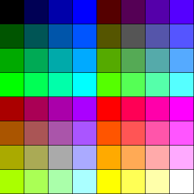

<!-- Author:  Lyall Jonathan Di Trapani =========|=========|======== -->
Video subsystem for LJD 16-bit computer
=======================================

Author:  Lyall Jonathan Di Trapani


Overview
--------

The Video Display Processor (VDP) is responsible
for generating the video signal.

- 320 x 200 2-layer pixel screen or 640 x 200 1-layer pixel screen
- Tile set: (8 x 8, 2 bpp)
    - 256 background tiles
    - 256 foreground tiles
- 2 layers (in 320 x 200 mode):
    - Background layer: 40 x 25 cells per frame
    - Foreground layer: 40 x 25 cells per frame
- 1 layer (in 640 x 200 mode):
    - Background layer: 80 x 25 cells per frame
- Colors are 6-bits with (2:2:2) RGB color format
- Up to 28 simultaneous colors on screen


Video RAM
---------

```
Words   Purpose                 Description
------------------------------------------------------------------------------
2,048   Background Tiles        256 8 x 8 2 bpp tiles (8 W / tile)
2,048   Foreground Tiles        256 8 x 8 2 bpp tiles (8 W / tile)
  250   Color Cells             40 x 25 grid; 4 bits/cell; 10 words per row x 25
1,000   Tile Cells              40 x 25 cells x 1 word
```


VDP Registers (write-only)
--------------------------

```
    8   Background Palettes     16 6-bit colors; 4 groups of 4 colors
    8   Foreground Palettes     16 6-bit colors; 4 groups of 4 colors
```


Background Color Palette
------------------------

A background color palette consists of a set of 4 6-bit colors.
There are 4 background color palettes.
The colors are labeled in order, from left to right, 0-3.

The 4 colors take up 2 16-bit words in memory:

```
Size: 2 words

 F E D C B A 9 8 7 6 5 4 3 2 1 0
---------------------------------
|    color 0    |   color 1     |
---------------------------------

 F E D C B A 9 8 7 6 5 4 3 2 1 0
---------------------------------
|    color 2    |   color 3     |
---------------------------------
```


Foreground Color Palette
------------------------

A foreground color palette consists of a set of 3 6-bit colors.
There are 4 foreground color palettes.
The colors are labeled in order, from left to right, 0-3.

The 3 colors take up 2 16-bit words in memory:

These are unused in 1-layer high-resolution 640 x 200 mode.

```
Size: 2 words

 F E D C B A 9 8 7 6 5 4 3 2 1 0
---------------------------------
|    Unused     |   color 1     |
---------------------------------

 F E D C B A 9 8 7 6 5 4 3 2 1 0
---------------------------------
|    color 2    |   color 3     |
---------------------------------
```


Color Cells
-----------

The screen is split into a grid of 8 x 8 pixel regions
called color cells.
In 2-layer 320 x 200 mode, the grid is 40 x 25 cells.
In 1-layer 640 x 200 mode, the grid is 80 x 25 cells.
One tile cell fits in each color cell.
The in 2-layer mode, color cell determines which foreground
color palette and which background color palette is active
for the 8 x 8 color cell.

2-layer 320 x 200 mode
```
Size 1/4 word (= 4 bits)

The first 2 bits of a color cell define the foreground palette and
the second 2 bits define the background palette.

Four color cell definitions fit in one word.

 F E D C B A 9 8 7 6 5 4 3 2 1 0
---------------------------------
|  cc0  |  cc1  |  cc2  |  cc3  |
---------------------------------
```

There are 40 color cells per row.
A row of color cells needs 10 words.  There are 25 rows.  So 10 * 25 = 250 words.

In 1-layer high-res mode, a color cell only defines a single 2 bit background
palette.  This means there are 8 color cells per word.
So only 250 words are needed in 1-layer mode.


Tile Cell
---------

The screen is split into grid of 8 x 8 pixel regions called tile cells.
In 2-layer 320 x 200 mode, the grid is 40 x 25 cells.
In 1-layer 640 x 200 mode, the grid is 80 x 25 cells.
A background tile and foreground tile is selected for each cell.
A tile cell contains a background tile index followed by a foreground tile index.
Each index is a one byte value that points to a single tile in the
respective background/foreground tile set.

Regardless of mode, we only need 1,000 words to define all the tile cells.
In 2-layer mode, each word can hold 1 tile cell, but there are half as many.
In 1-layer mode, each word can hold 2 tile cells, but there are twice as many.

2-layer mode
```
Size:  1 word

 F E D C B A 9 8 7 6 5 4 3 2 1 0
---------------------------------
|  bg index     |   fg index    |
---------------------------------
```

1-layer mode
```
Size:  1 word

 F E D C B A 9 8 7 6 5 4 3 2 1 0
---------------------------------
|  bg index     |   bg index    |
---------------------------------
```


Tile
----

```
Size:  8 words
8 x 8 pixel tiles = 64 pixels
2 bits per pixel (2 bpp)
Each word contains 8 pixels (1 row)
The pixel value serves as a lookup key into the active color palette
of the cell location the tile is placed within.
For a background tile, colors are as follows:
If the pixel is 0, it takes color 0.
If the pixel is 1, it takes color 1.
If the pixel is 2, it takes color 2.
If the pixel is 3, it takes color 3.
For a foreground tile, colors are looked up in
the same fashion, except if the pixel is set to 0, the pixel is
transparent.  In other words, color 0 of the active background palette
for that location is used instead.
So tiles placed in the foreground layer only use 3 colors (1-3) from
their palette, because color 0 is transparent.
```


Colors
------

```
A color is 6 bits in a 2-2-2 RGB format.

R Red color component
G Green color component
B Blue color component

Layout of a color

 7 6 5 4 3 2 1 0
-----------------
|0 0|R R|G G|B B|
-----------------

```


Available Colors
----------------


